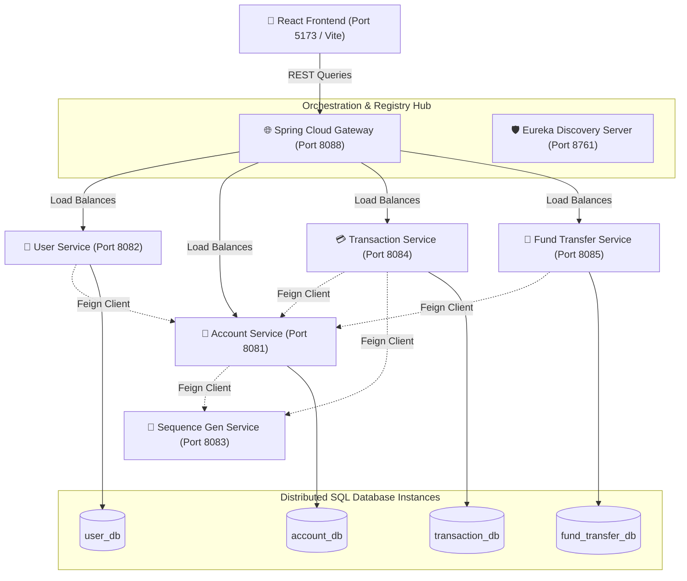

# 🏛️ Finexus: Modern Microservices Banking Platform

[](https://www.java.com/)
[](https://spring.io/projects/spring-boot)
[](https://react.dev/)
[](https://www.typescriptlang.org/)
[](https://tailwindcss.com/)
[](https://www.mysql.com/)

**Finexus** is an enterprise-grade digital banking application engineered with a decoupled, high-resilience **microservices architecture** on the backend and a modern, high-performance **React client** on the frontend. It models real-world transactional integrity, service independence, and secure authorization across distributed systems.

---

## 🏗️ System Architecture & Data Flow

Finexus is designed around the **Database-per-Service** pattern to ensure strict boundary isolation between business contexts. External clients interact solely through an API Gateway, which handles request routing and load balancing via service discovery.



---

## ⚡ High-Impact Technical Highlights

### 🛠️ Backend Microservices Ecosystem
- **Decoupled Architecture**: Spring Boot microservices representing isolated business operations: User Profiles, Accounts, Transactions, and Fund Transfers.
- **Service Registry & Discovery**: Netflix Eureka dynamically monitors service health, scales instances, and maps route endpoints.
- **Dynamic Routing**: Spring Cloud Gateway acts as the single entry point, managing CORS, global logging, and security handshakes.
- **Inter-Service Communication**: OpenFeign clients execute type-safe, synchronous inter-service REST calls.
- **Sequence Generation**: Dedicated helper service generates collision-free, formatted account, transaction, and reference IDs.

### 📱 Modern React Client
- **State of the Art Tech Stack**: Built with React 19, TypeScript 6.0, and Vite for lightning-fast hot module replacement.
- **Tailwind CSS 4.0**: Employs the latest CSS-first configuration and fluid responsive design tokens.
- **Predictable State Management**: Zustand handles client-side global authentication and caching state without boilerplate context.
- **Robust UI Framework**: Lucide React for consistent iconography and Recharts for live transaction telemetry.

### 💾 Data & Security Integrity
- **Isolated MySQL Schemas**: Strictly implements database-per-service to prevent cross-service database coupling.
- **Transactional Consistency**: Relational database operations managed with JPA/Hibernate transactions to prevent balance anomalies.
- **Layered Security**: Configured with Spring Security, stateless JSON Web Tokens (JWT), and OAuth2/Keycloak hooks for user credential protection.

---

## 🚦 Microservice & Port Inventory

| Service / App | Port | Context Path | Primary Responsibility / Tech Highlight |
| :--- | :---: | :--- | :--- |
| **Service-Registry** | `8761` | `/` | Netflix Eureka Discovery Hub |
| **API-Gateway** | `8088` | `/` | Spring Cloud Gateway proxy, routing client requests |
| **User-Service** | `8082` | `/api/users/` | Accounts, profiles, login, JWT issuance, Keycloak Hook |
| **Account-Service** | `8081` | `/accounts/` | Checking, savings, balance check, status updates |
| **Transaction-Service**| `8084` | `/transactions/` | Direct deposits, withdrawals, live database logs |
| **Fund-Transfer** | `8085` | `/api/fund-transfers/`| Validation, debit-to-credit multi-service coordination |
| **Sequence-Generator** | `8083` | `/` | System-wide unique sequence IDs |
| **React Frontend** | `5173` | `/` | React 19 Client Dashboard, Recharts visualization |

---

## 🚀 Quick Start Guide

### 📋 Prerequisites
- **Java JDK 17** or higher
- **Node.js v18+** & npm
- **MySQL 8.0+** running locally (port `3306`)

### 📦 Database Initialization
Create the database schemas in MySQL. You can use standard MySQL commands:
```sql
CREATE DATABASE user_db;
CREATE DATABASE account_db;
CREATE DATABASE transaction_db;
CREATE DATABASE fund_transfer_db;
```

Update the MySQL credentials in the environment variables file (`backend/.env` or equivalent) or directly in each service's `src/main/resources/application.properties`.

### ⚙️ Running the Backend Services
Services must be started in sequence so that service discovery resolves correctly:

1. **Start Eureka Server**:
   ```bash
   cd backend/Service-Registry
   mvn spring-boot:run
   ```
2. **Start API Gateway**:
   ```bash
   cd backend/API-Gateway
   mvn spring-boot:run
   ```
3. **Start Core Services** (in separate terminals or via IDE):
   ```bash
   # Run each of these commands in its respective folder inside backend/
   mvn spring-boot:run
   ```

*Windows users can utilize `backend/start-services.bat` to automate the sequential initialization of all backend microservices.*

### 🖥️ Running the Frontend Client
```bash
cd frontend
npm install
npm run dev
```
Open [http://localhost:5173](http://localhost:5173) in your browser.

---

<details>
<summary>📂 View Database Schemas</summary>

### User Profiles (`user_db`)
```sql
CREATE TABLE user (
    id BIGINT PRIMARY KEY AUTO_INCREMENT,
    email_id VARCHAR(255) UNIQUE NOT NULL,
    contact_no VARCHAR(20),
    password VARCHAR(255) NOT NULL,
    auth_id VARCHAR(255),
    identification_number VARCHAR(50),
    status ENUM('ACTIVE', 'INACTIVE', 'PENDING') DEFAULT 'PENDING',
    user_profile_id BIGINT,
    created_date TIMESTAMP DEFAULT CURRENT_TIMESTAMP,
    updated_date TIMESTAMP DEFAULT CURRENT_TIMESTAMP ON UPDATE CURRENT_TIMESTAMP
);

CREATE TABLE user_profile (
    id BIGINT PRIMARY KEY AUTO_INCREMENT,
    first_name VARCHAR(100) NOT NULL,
    last_name VARCHAR(100) NOT NULL,
    address TEXT,
    date_of_birth DATE
);
```

### Accounts (`account_db`)
```sql
CREATE TABLE account (
    id BIGINT PRIMARY KEY AUTO_INCREMENT,
    account_number VARCHAR(20) UNIQUE NOT NULL,
    user_id BIGINT NOT NULL,
    account_type ENUM('SAVINGS', 'CURRENT', 'LOAN') NOT NULL,
    balance DECIMAL(15,2) DEFAULT 0.00,
    status ENUM('ACTIVE', 'INACTIVE', 'CLOSED') DEFAULT 'ACTIVE',
    created_date TIMESTAMP DEFAULT CURRENT_TIMESTAMP,
    updated_date TIMESTAMP DEFAULT CURRENT_TIMESTAMP ON UPDATE CURRENT_TIMESTAMP
);
```

### Transactions (`transaction_db`)
```sql
CREATE TABLE transaction (
    id BIGINT PRIMARY KEY AUTO_INCREMENT,
    transaction_id VARCHAR(50) UNIQUE NOT NULL,
    account_id BIGINT NOT NULL,
    transaction_type ENUM('DEPOSIT', 'WITHDRAWAL', 'TRANSFER_IN', 'TRANSFER_OUT'),
    amount DECIMAL(15,2) NOT NULL,
    balance_after DECIMAL(15,2) NOT NULL,
    description TEXT,
    status ENUM('PENDING', 'COMPLETED', 'FAILED') DEFAULT 'PENDING',
    created_date TIMESTAMP DEFAULT CURRENT_TIMESTAMP
);
```

### Fund Transfers (`fund_transfer_db`)
```sql
CREATE TABLE fund_transfer (
    id BIGINT PRIMARY KEY AUTO_INCREMENT,
    transfer_id VARCHAR(50) UNIQUE NOT NULL,
    from_account_id BIGINT NOT NULL,
    to_account_id BIGINT NOT NULL,
    amount DECIMAL(15,2) NOT NULL,
    description TEXT,
    status ENUM('PENDING', 'COMPLETED', 'FAILED') DEFAULT 'PENDING',
    created_date TIMESTAMP DEFAULT CURRENT_TIMESTAMP
);
```
</details>

<details>
<summary>📝 View API Endpoints Summary</summary>

All requests go through API Gateway (`http://localhost:8088`).

| Service | Method | Route | Description |
| :--- | :---: | :--- | :--- |
| **Users** | `POST` | `/api/users` | Register a new client user |
| **Users** | `GET` | `/api/users/{id}` | Fetch profile details by ID |
| **Accounts**| `POST` | `/accounts` | Create checking/savings account |
| **Accounts**| `GET` | `/accounts/user/{userId}` | List accounts belonging to a user |
| **Txns** | `POST` | `/transactions/deposit` | Credit funds to an account |
| **Txns** | `POST` | `/transactions/withdraw` | Debit funds from an account |
| **Transfers**| `POST` | `/api/fund-transfers` | Initiate inter-account transfer |

</details>

---

**Happy Banking! 🏦✨**
